# PFSense Configuration fpr M-Net (Munich ISP)

## Introduction
This guide provides step-by-step instructions to configure pfSense with M-net, an ISP from Munich, Germany. The goal is to obtain an IPv6 address from the ISP and use it to enable IPv4 internet access in your home network.

To overcome the trouble with the IPv6 Address, it is possible to book the option for an IPv4 Address through the customer support --> costs 5€/month, subscription can be canceled each month

## Network Flow

## Prerequisites
- A pfSense firewall installed and running
- An active M-net internet connection/ contract
- M-Net access credentials

## Steps

### 1. Praperation

#### 1.1. Get M-Net credentials
-   Login to https://kundenportal.m-net.de
-   Go to your Contract
-   Get Login Credentials

#### 1.2. Connect Network
-   Connect LAN Cable from ONT to WAN Interface of your pfsense Firewall WAN Port
-   Connect LAN Cable from your Laptop to pfsense Firewall LAN Port

### 2. Access and Configuration

Log in to your pfsense Administration Console

-   create a VLAN on Parent Interface `igc0` (`WAN interface`)
    
    -   VLAN Tag `40`

-   Setup `WAN`interface that the request for a IPv6 address gets requested through the IPv4 connection
    -   IPv4 Configuration Type: `PPPoE`
    -   IPv6 Configuration Type: `DHCP6`

    DHCP6 Client Configuration
    -   [x] `Request a IPv6 prefix/information through the IPv4 connectivity link`
    -   DHCPv6 Prefix Delegation size: `56`
    -   [x] `Send an IPv6 prefix hint to indicate the desired prefix size for delegation`

    PPPoE Configuration
    -   Username: `your-m-net-user-account@mdsl.mnet-online.de`
    -   Password: `your-m-net-user-password`
    -   Advanced and MLPPP: Link Interface to `ics0.40 M-Net`

-   create a GIF on Parent Interface `LAN` 
    
  -   GIF Remote Address: `2001:a60:0:f::ffff` --> quals AFTR Address `aftr.prod.m-online.net`
    
    -   GIF tunnel local Address: `192.0.0.2`

    -   GIF tunnel remote Address: `192.0.0.1`

    -   GIF tunnel subnet: `29`

-   assign Interface called `dslite` on Network interface `GIF 2001:a60:0:f::ffff`

-   activate `dslite` interface and set
    -   MSS: `1492`

-   Setup `LAN`interface
    -   IPv4 Configuration Type: `Static IPv4`
    -   IPv6 Configuration Type: `Track Interface`
    
    Static IPv4 Configuration
    -   IPv4 Address: `10.0.0.1` / `24`

    Track IPv6 Interface
    -   IPv6 Interface: `WAN`

-   Go to System > Routing and set Default Gateway ipv4 to `WAN_PPPOE`

### 3. Confirm Setup

Go to Interface Assignments and check if all relevant interfaces are assigne and activated (click on each interface and check if Interface is enabled)

-   `WAN`: `PPPOE0(igc0.40) - WAN PPPoE`
-   `LAN`: `igc1`
-   `dslite`: `GIF 2001:a60:0:f::ffff`

under Diagnostics > Reboot, Reboot your pfsense Device

## Conclusion
By following these steps, you should be able to configure pfSense to obtain an IPv6 address from M-net and use it to enable IPv4 internet access in your home network.

Shoutout to pr from https://cybercyber.org/m-net-ds-lite-anschluss-mit-pfsense.html
